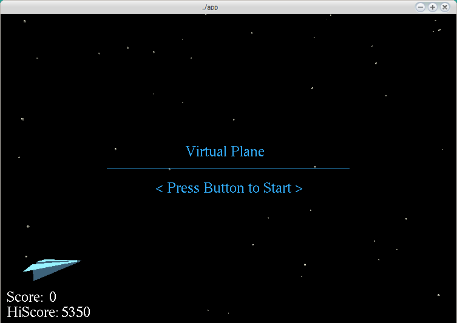
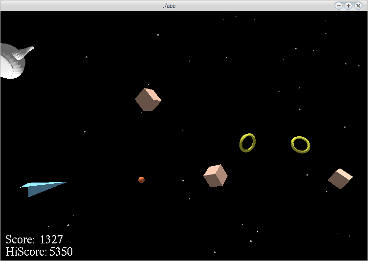

# Virtual Plane (仮)

紙飛行機を上下に動かして弾を発射し、リングを集めブロックを壊すシューティング?ゲームです。

Arduinoなどのマイコンをコントローラとして使用します。
Arduinoに接続した超音波センサ(HC-SR04)を下に向け、机などとの距離に応じて上下に動きます。
また、Arduinoに接続したボタンを押すことで弾を発射します。

Arduinoが接続されてない場合マウスで代用できます。(左クリックのドラッグで動かし、右クリックで発射)





## 起動方法

```
sudo apt install freeglut3-dev portaudio19-dev
make
./app
```

## Arduino側

us_arduino.inoを書き込み2,3番ピンに超音波センサ、4番ピンに押しボタンをつける
